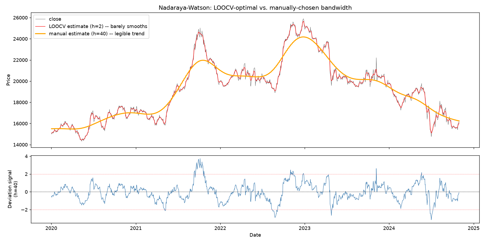

# Kernel Regression: Nadaraya-Watson Trend Estimation

**Program 3 of the NQ decision-support system.** This writeup covers what
the Nadaraya-Watson estimator computes and why, two methodological
limitations worth understanding before trusting its output, and what it
actually produces on the project's synthetic NQ data.

Code: [`src/kernel_regression.py`](../../src/kernel_regression.py). Tests:
[`tests/test_kernel_regression.py`](../../tests/test_kernel_regression.py).

## 1. What it computes

Nadaraya-Watson is non-parametric local regression: instead of fitting a
single trend line or a fixed-window moving average, it estimates price at
each point in time as a weighted average of *every* observation in the
sample, where the weight on each observation decays smoothly with its
distance from the point being estimated (a Gaussian kernel of width — the
"bandwidth" — `h`):

```
m_hat(x0) = Σ K((x0 - x_i) / h) * y_i  /  Σ K((x0 - x_i) / h)
```

The practical effect is a smoothed "fair value" curve for price. The
deviation of actual price from that curve, standardized by the residual
scale, is exposed as a signal: large positive deviations mean price is
trading well above its local trend, large negative deviations mean well
below.

## 2. Two things worth knowing before trusting the output

### It's a retrospective smoother, not a causal one

The estimator at time `t` uses every observation in the sample, including
ones *after* `t`. That's fine for understanding where price sat relative to
its local trend historically, but using it as a live signal as-is would
leak lookahead information — the "trend" at a given day is partly informed
by what happened afterward. A causal, one-sided variant (only weighting
past observations) is a straightforward restriction of the same kernel
formula, but building and validating that properly belongs with Phase 7's
walk-forward framework, which is where causal discipline gets applied
project-wide rather than piecemeal per program.

### Automatic bandwidth selection answers a different question than you'd expect

`loocv_select_bandwidth` picks the bandwidth that minimizes leave-one-out
cross-validation error — the standard, textbook-correct approach to
bandwidth selection. On this project's synthetic NQ price series, though,
it reliably selects the *smallest* bandwidth in the candidate grid:

| Bandwidth | LOOCV MSE |
|---:|---:|
| 2 | 35,786 |
| 3 | 48,034 |
| 5 | 74,030 |
| 8 | 114,237 |
| 12 | 172,623 |
| 18 | 274,648 |
| 27 | 443,074 |
| 40 | 700,542 |
| 60 | 1,122,308 |
| 90 | 1,694,069 |
| 135 | 2,281,534 |

The error climbs monotonically with bandwidth — there's no interior
minimum to find. This isn't a bug: asset prices are close to a random walk
(highly persistent), so each day's price is almost the best available
predictor of the next day's, and minimizing one-step reconstruction error
will always favor tracking price as closely as possible. At the
LOOCV-selected bandwidth (`h=2`), the fitted curve is barely distinguishable
from raw price, and the resulting deviation signal is mostly short-term
noise rather than anything resembling "distance from a trend."

LOOCV is answering "what bandwidth generalizes best for one-step
prediction," correctly. It is not answering "what bandwidth produces a
trend line a human finds useful," which is what the deviation-signal
framing in this module actually wants. Those are different questions with
different answers, and conflating them would be the actual mistake — not
picking the smaller bandwidth that LOOCV found.

## 3. What it looks like on the project's synthetic NQ data

The plot below shows both answers side by side: the LOOCV-selected `h=2`
curve (red, tracking price almost exactly) against a manually chosen
`h=40` (orange, a legible trend), with the `h=40` deviation signal plotted
underneath.



Quantifying the difference directly — "roughness" here is the mean
absolute standardized day-to-day change, so lower means smoother:

| Series | Roughness |
|---|---:|
| Raw price | 0.0557 |
| LOOCV estimate (h=2) | 0.0245 — barely smoother than price itself |
| Manual estimate (h=40) | 0.0064 — a genuinely smooth trend |

The `h=40` deviation signal has a standard deviation of 1.0 by
construction and ranges from about -3.1 to +3.7 over the ~5-year series,
with the largest excursions (the 2022-ish peak near +3.7, visible in the
plot) occurring exactly where price ran up fastest relative to its recent
trend — consistent with what a mean-reversion-style indicator should flag.

## 4. Where this leaves things

The estimator itself is correct — validated in
`tests/test_kernel_regression.py` against a known smooth function (recovers
it to within the noise floor), exact convergence at both bandwidth
extremes, and a from-scratch brute-force recomputation of the LOOCV scores
matching the vectorized implementation exactly. What's *not* settled is
which bandwidth to actually use for a live signal: LOOCV's answer is
principled but not useful for this purpose, and a manually chosen one (like
`h=40` above) is useful but currently just a reasonable-looking choice, not
a validated one. Which bandwidth, if any, is actually predictive is an
empirical question for Phase 7's walk-forward framework, same as the
causality question above — this program gives the building block
(`nadaraya_watson_regression`, usable with any bandwidth), not yet a
validated trading parameter.
