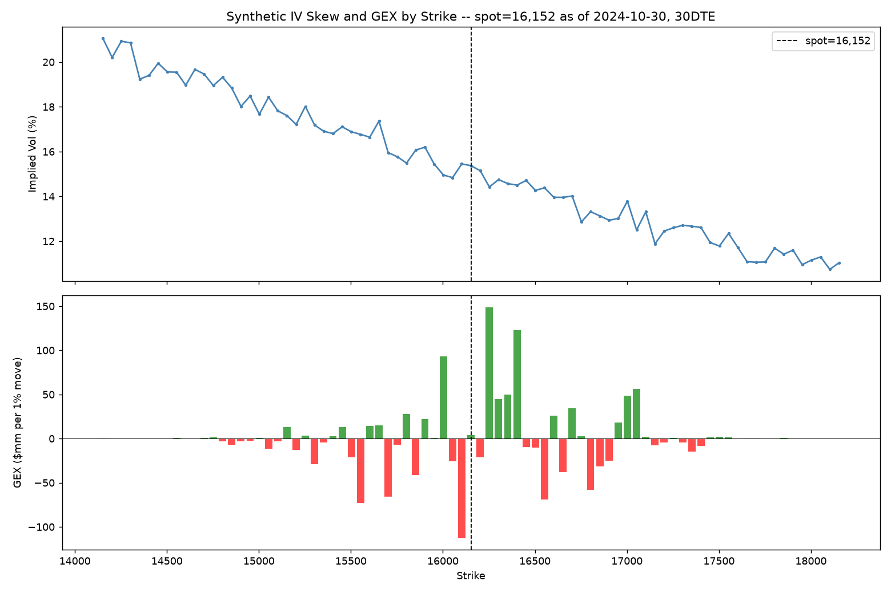

# Greeks Dashboard: Black-Scholes, Gamma Exposure, and Vanna Exposure

**Program 4 of the NQ decision-support system.** This writeup covers the
Black-Scholes Greeks computed, the dealer-positioning convention behind
Gamma Exposure (GEX) and Vanna Exposure (VEX), the assumptions behind the
synthetic options chain this all runs on, and an example dashboard snapshot.

Code: [`src/greeks_dashboard.py`](../../src/greeks_dashboard.py). Tests:
[`tests/test_greeks_dashboard.py`](../../tests/test_greeks_dashboard.py).

## 1. The Greeks

Standard closed-form Black-Scholes-Merton Greeks for European options:
Delta, Gamma, Theta, Vega, Rho, and Vanna (the cross-derivative of Delta
with respect to volatility, equivalently of Vega with respect to spot).
Nothing unusual in the formulas themselves, but they were validated more
rigorously than "the formulas are textbook, so they're fine": every Greek
is checked against a finite-difference derivative of the pricing function
itself (central differences, both calls and puts), and put-call parity is
checked exactly. One real bug surfaced during that validation — not in the
Greeks, but in the first finite-difference check for Theta, which forgot
that this module returns the conventional "decay" sign (`-dPrice/dT`), not
the raw derivative. Fixed before anything shipped; the point of validating
against an independent method is that it catches exactly this kind of
thing.

Gamma and Vanna are identical for calls and puts at the same
strike/expiry/vol under Black-Scholes (a consequence of put-call parity:
`Delta_put = Delta_call - e^{-qT}`, a constant shift that vanishes under
differentiation), which is why `compute_gamma_exposure` and
`compute_vanna_exposure` only need one Greek value per strike, not one per
option type.

## 2. GEX / VEX and the dealer-positioning convention

Gamma Exposure aggregates each strike's Gamma, weighted by open interest,
into a single number describing how dealer hedging flows are expected to
respond to price moves. The convention used here — dealers assumed net
long gamma from calls and net short gamma from puts — is the standard
simplifying assumption behind essentially every public GEX dashboard
(SqueezeMetrics, SpotGamma, and the retail commentary descended from them),
not something specific to this project. It has to be an assumption
anywhere it's used: actual dealer positioning isn't public data, so no GEX
tool — real or synthetic — observes it directly.

The practical interpretation: positive GEX means dealers are expected to
hedge in a way that *dampens* realized volatility (buying dips, selling
rallies to stay delta-hedged); negative GEX means the opposite —
hedging flows that *amplify* moves. Vanna Exposure uses the identical
per-strike formula and sign convention, substituting Vanna for Gamma, and
describes how that hedging behavior is expected to shift as implied vol
itself moves.

## 3. The synthetic options chain

There's no real options data yet (Phase 6), so `generate_synthetic_option_chain`
builds a placeholder chain around a given spot price, under four explicit
assumptions:

1. **Strikes** are evenly spaced around spot — a stand-in for a real listed
   strike grid, not calibrated to actual NQ option listings.
2. **Implied vol follows a downward-sloping quadratic skew** in
   log-moneyness: higher IV for low (put-side) strikes than high
   (call-side) ones. Directionally realistic for equity-index options (the
   well-documented skew driven by crash-hedging demand), but the specific
   slope and curvature are illustrative, not fit to real NQ quotes.
3. **Open interest is concentrated near the money** and decays with
   distance from it — a reasonable qualitative pattern (real OI does
   cluster near spot and at round strikes), but not calibrated to real
   positioning data, which in any case reflects actual market participants'
   choices that can't be synthesized from a price series alone.
4. **Call and put open interest are drawn independently**, both decaying
   the same way with distance from the money — this does not encode any
   real skew in put-vs-call demand.

None of these are calibrated to real NQ options. They produce a
directionally sensible, non-degenerate chain for testing the Greeks/GEX/VEX
logic — nothing more, until Phase 6 replaces this with real data.

## 4. Example snapshot

A representative snapshot using the last close in the project's synthetic
NQ series (spot = 16,152.5 as of 2024-10-30, 30 days to expiry):

| | Value |
|---|---:|
| Total GEX | +$46,746,024 (per 1% move) |
| Total VEX | +$842,609,566,771 (per 1% move, per 1-point vol move) |
| ATM implied vol (nearest strike) | 15.37% |
| Avg IV, put side (strikes < spot) | 17.88% |
| Avg IV, call side (strikes > spot) | 12.73% |

Positive total GEX here reads as "dampening" under the convention above.
The skew (top panel below) shows the documented downward slope — richer
puts, cheaper calls — and the per-strike GEX (bottom panel) shows how that
total is actually built: concentrated, alternating-sign contributions near
the money rather than a smooth distribution, since each strike's sign
depends on whether call or put open interest dominates there.

The five largest `|GEX|` contributions are all within a few hundred points
of spot (16,002 through 16,402), which is expected — Gamma itself peaks
near the money, so that's where open interest differences get the most
leverage regardless of which side of the chain they're on.

## 5. Where this leaves things

The math is solid — every Greek is cross-checked against an independent
numerical method, not just copied from a textbook. What's synthetic is the
*input*: the chain's strikes, skew, and open interest are all placeholders
with explicitly documented, uncalibrated assumptions. A total GEX of
+$46.7mm is only as meaningful as the chain that produced it; the number
itself is real output from real code, but it describes a synthetic market,
not NQ's actual positioning. That gap closes with Phase 6, not before.
