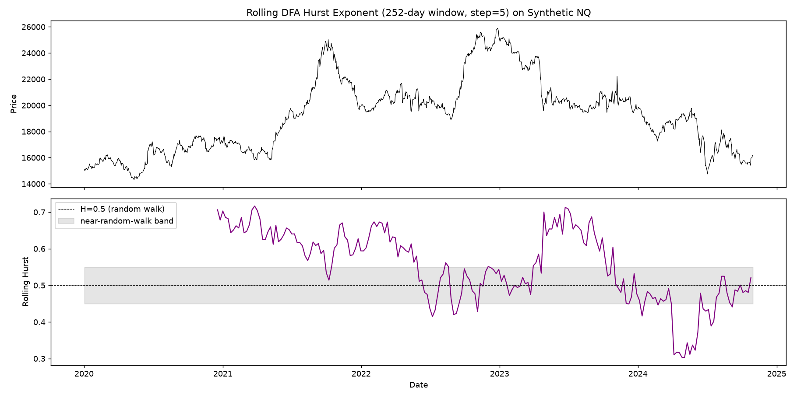

# Rolling Hurst Exponent: A Threshold Modulator, Not a Fifth Vote

**An addition to Phase 5 (Consensus Engine).** This writeup covers what
Detrended Fluctuation Analysis measures, why it plugs into the consensus
engine as a threshold modulator rather than a fourth directional vote
(mirroring Program 4's GEX design), a real methodological dead-end hit
while choosing test fixtures, and a worked example on the project's
synthetic NQ data.

Code: [`src/hurst_exponent.py`](../../src/hurst_exponent.py). Tests:
[`tests/test_hurst_exponent.py`](../../tests/test_hurst_exponent.py).

## 1. What DFA measures

The Hurst exponent describes how persistent a return series currently is.
Detrended Fluctuation Analysis estimates it by: demeaning the returns and
cumulatively summing them (the "integrated profile"); splitting that
profile into segments at a range of box sizes; fitting a linear trend to
each segment and measuring the RMS of the detrended residual; averaging
those residuals at each box size into a fluctuation function F(n); and
reading the Hurst exponent off the slope of log(F(n)) vs. log(n). This
follows the standard DFA procedure used across the long-memory literature,
including papers applying it to FX markets (e.g. Asif & Frommel 2022,
*Testing long memory in exchange rates and its implications for the
adaptive market hypothesis*, Physica A 593).

H≈0.5 means the series behaves like a random walk at the scales tested — no
persistent structure to exploit. H significantly above 0.5 means trending
behavior (an up-move tends to be followed by more up-move). H significantly
below 0.5 means mean-reversion (an up-move tends to be followed by a
pullback).

## 2. Why this is a threshold modulator, not a fourth vote

`src/consensus_engine.py` already drew this exact category line for
Program 4's Gamma Exposure: GEX describes how price is expected to
*behave* (dampened or amplified moves), not which way it's going, so it's
kept out of the 3-way directional vote and surfaced as separate
`volatility_regime` context instead. The Hurst exponent is the same kind
of signal for the same reason. It describes how persistent or
mean-reverting the price process currently is — genuinely useful
information about whether there's structure worth trusting a directional
call on — but it carries no sign that means "bullish" or "bearish." A
market can be strongly trending while trending *down*, or strongly
mean-reverting while centered *above* its recent range; Hurst alone
doesn't say which. Forcing it into the vote would manufacture a directional
claim identical in kind to the one the GEX design note already rejected.

Instead, `compute_consensus_with_hurst` uses Hurst to adjust *how much
agreement the engine needs before calling a direction at all*: it widens
`compute_consensus`'s neutral band when there's little persistent structure
to trade on (Hurst near 0.5) and narrows it when there's a lot (Hurst far
from 0.5 in either direction). That's a statement about signal quality, not
a sign-carrying vote — a genuinely different role from Programs 1-3's
votes, and the same role GEX already occupies.

### The mechanism, and its one real limitation

`compute_consensus` reads its neutral band from a module-level constant
(`NEUTRAL_BAND`), not a function parameter — so widening or narrowing it
without changing that function's signature means temporarily reassigning
the module attribute for the duration of one call, then restoring it in a
`finally` block. This works correctly (verified directly: the original
value survives both normal calls and calls where `compute_consensus`
raises), but it is **not thread-safe** — concurrent calls from different
threads could observe the wrong band mid-call. That's an acceptable
tradeoff for this single-threaded codebase, not something to rely on
without revisiting the design in a concurrent context.

### What happens when the estimate isn't statistically significant

`hurst_to_threshold_multiplier` doesn't just look at the point estimate —
it takes the bootstrap confidence interval too. If the interval includes
0.5, the data can't actually distinguish this window from a random walk at
the chosen confidence level, so the multiplier is forced to its widest
setting regardless of where the point estimate happens to sit. Trusting a
point estimate that isn't statistically significant would be worse than
just admitting there's no reliable signal here.

## 3. A real dead end: the obvious trending test fixture didn't work

The plan was to reuse `src/synthetic_data.py`'s existing
`generate_regime_switching_returns` (the realistic generator) as the
"trending" DFA test case. It didn't work. Across seeds, the realized Hurst
hovered right around 0.5 regardless of sample length:

| n_days | Hurst across 7 seeds | mean |
|---:|---|---:|
| 500 | 0.48, 0.56, 0.57, 0.51, 0.66, 0.46, 0.45 | 0.526 |
| 1000 | 0.52, 0.50, 0.51, 0.50, 0.50, 0.48, 0.48 | 0.498 |
| 2500 | 0.54, 0.49, 0.59, 0.48, 0.51, 0.52, 0.54 | 0.524 |

The realistic generator's regime persistence is real, but its effect size
is too small relative to day-to-day volatility for DFA to reliably detect
as long-range dependence — consistent with
[docs/writeups/01_regime_detection.md](01_regime_detection.md)'s finding
that this same generator is genuinely hard even for the thing it was built
to test (HMM regime recovery).

The fix was a parameter choice, not new code: `generate_well_separated_regime_returns`
(the same generator `tests/test_regime_detection.py` already uses, reused
here rather than duplicated) with a *moderate* mean-separation override —
smaller than that test's own default, but far larger than the realistic
generator's daily drift differences — gives a robust, intuitive result:

| Config | Hurst across 7 seeds | mean | min |
|---|---|---:|---:|
| Default params (bull mean=0.02) | 1.21-1.28 | 1.243 | 1.212 |
| Moderate override (bull mean=0.005) | 0.75-0.91 | 0.834 | 0.754 |
| Small override (bull mean=0.002) | 0.53-0.72 | 0.611 | 0.528 |

(The default, more-separated params give Hurst *above 1* — a legitimate
DFA result for a series with large deterministic level shifts between
segments, not a bug, but a less intuitive number for a test fixture meant
to simply confirm "significantly above 0.5" without a tangent into why DFA
can exceed its naive [0,1] range. The moderate override avoids that tangent
while still clearing 0.5 with a comfortable, robust margin.) The project's
test suite (`tests/test_hurst_exponent.py`) uses that moderate override,
parametrized across 7 seeds, specifically because the first, more obvious
choice turned out not to generalize.

For the mean-reverting case, `generate_ornstein_uhlenbeck` (added to
`src/synthetic_data.py` for this purpose) worked as expected on the first
try — OU is a textbook mean-reverting process, and DFA on its increments
gives Hurst in the 0.17-0.19 range at `theta=0.15`, robust across seeds, no
parameter search needed.

## 4. On the project's synthetic NQ data

Rolling Hurst (252-day window, every 5th day) over the full ~5-year
synthetic series:



The estimate genuinely moves — from about 0.30 (mean-reverting) to about
0.72 (trending) — tracking visible character changes in the price series
itself: clearly trending stretches (the 2021 and 2023 run-ups) register
well above 0.5, while the choppier mid-2024 period registers well below it.
The whole-series estimate is 0.558 with a 95% bootstrap CI of (0.461,
0.614), which includes 0.5 — over the full 5 years, this series isn't
distinguishable from a random walk, even though specific windows within it
clearly are.

**Worked example**, using the last 252-day window (Hurst=0.532, CI=(0.360,
0.628) — includes 0.5, so the widest multiplier applies, doubling the band
from 0.15 to 0.30) and a case chosen to make the mechanism's effect
visible: regime=`sideways`, order flow signal=1.0, kernel deviation=0.0,
GEX=+46.7mm (the same snapshot from
[docs/writeups/04_greeks_dashboard.md](04_greeks_dashboard.md)):

```
plain compute_consensus:       score=0.154  label=bullish   (clears the default 0.15 band)
compute_consensus_with_hurst:  score=0.154  label=neutral   (same score, now inside the widened 0.30 band)
```

Identical inputs, identical score — the only thing that changed is how
much agreement was required to act on it, because the last year of this
series doesn't have statistically significant persistent structure to lean
on.

## 5. Where this leaves things

The DFA implementation is validated the way this project validates its
other numerical methods: against a known case (white noise gives
H≈0.5, within 0.07 across a 3000-point sample), against theoretically
predictable cases (OU mean-reversion and the moderate-separation trending
fixture both land reliably on the correct side of 0.5 across seeds), and
against an independent reference (a white-box test confirms the vectorized
closed-form detrending matches an unvectorized `np.polyfit`-per-segment
computation exactly). The vectorization itself mattered in practice, not
just as an optimization nicety: the naive per-segment loop made a single
200-resample bootstrap CI take 22 seconds; the vectorized version takes
0.37.

What isn't validated is whether widening/narrowing the neutral band this
way actually improves decision quality — the multiplier's shape (linear in
|H-0.5|, max 2.0, min 0.5) is a reasonable-looking choice, not a
backtested one, same caveat as the mean-reversion interpretation of
Program 3's vote and the equal default weights in
[docs/writeups/05_consensus_engine.md](05_consensus_engine.md). That's
Phase 7's job, for this addition and everything it sits on top of.
